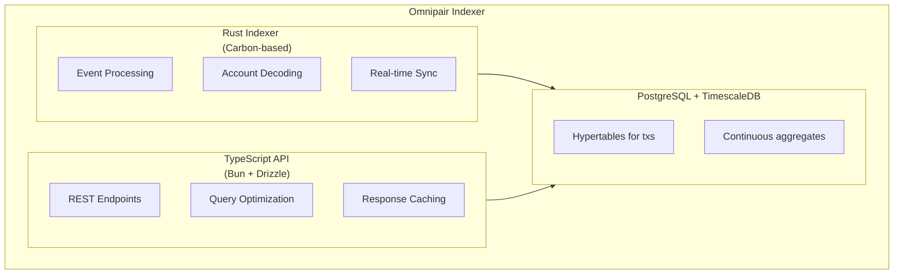

## Overview

The Omnipair Indexer provides a REST API for querying real-time and historical protocol data. Built with Rust and TypeScript, it indexes on-chain events to PostgreSQL with TimescaleDB for efficient time-series queries.

<Card title="Base URL" icon="link">
  `https://api.indexer.omnipair.fi/api/v1`
</Card>

<CardGroup cols={2}>
  <Card title="GitHub Repository" icon="github" href="https://github.com/omnipair/omnipair-indexer">
    Indexer source code
  </Card>
  <Card title="API Root" icon="server" href="https://api.indexer.omnipair.fi/">
    View API endpoints
  </Card>
</CardGroup>

---

## Pools Endpoints

### List Pools

Retrieve all trading pools with optional filters.

```
GET /api/v1/pools
```

**Query Parameters:**

| Parameter | Type | Description |
| --------- | ---- | ----------- |
| `token0` | `string` | Filter by token0 mint address |
| `token1` | `string` | Filter by token1 mint address |
| `limit` | `number` | Results per page (default: 100, max: 1000) |
| `offset` | `number` | Pagination offset (default: 0) |
| `sortBy` | `string` | Sort field: `tvl`, `volume24h`, `apr` |
| `sortOrder` | `string` | Sort direction: `asc`, `desc` |

**Example:**

```bash
curl "https://api.indexer.omnipair.fi/api/v1/pools?sortBy=tvl&sortOrder=desc&limit=10"
```

**Response Fields:**

| Field | Type | Description |
| ----- | ---- | ----------- |
| `address` | `string` | Pool address |
| `token0` | `string` | Token0 mint |
| `token1` | `string` | Token1 mint |
| `reserve0` | `string` | Virtual reserve0 |
| `reserve1` | `string` | Virtual reserve1 |
| `tvl` | `number` | Total value locked (USD) |
| `swap_fee_bps` | `number` | Swap fee in basis points |
| `fixed_cf_bps` | `number \| null` | Fixed collateral factor (or null for dynamic) |

---

### Get Pool Info

Retrieve detailed information for a specific pool.

```
GET /api/v1/pools/{poolAddress}
```

**Example:**

```bash
curl "https://api.indexer.omnipair.fi/api/v1/pools/AbCdEf123..."
```

---

### Pool Statistics

Get pool statistics over a time window.

```
GET /api/v1/pools/{poolAddress}/stats
```

**Query Parameters:**

| Parameter | Type | Description |
| --------- | ---- | ----------- |
| `windowHours` | `number` | Lookback window (default: 24) |

**Response Fields:**

| Field | Type | Description |
| ----- | ---- | ----------- |
| `volume` | `number` | Trading volume (USD) |
| `fees` | `number` | Fees collected (USD) |
| `trades` | `number` | Number of trades |
| `priceChange` | `number` | Price change (%) |

---

### Pool Volume

Get detailed volume breakdown.

```
GET /api/v1/pools/{poolAddress}/volume
```

---

### Pool Fees

Get fee collection data.

```
GET /api/v1/pools/{poolAddress}/fees
```

---

### Price Chart

Get OHLCV price data for charting.

```
GET /api/v1/pools/{poolAddress}/price-chart
```

**Query Parameters:**

| Parameter | Type | Description |
| --------- | ---- | ----------- |
| `windowHours` | `number` | Lookback window (default: 24) |

<Note>
**Automatic Intervals:**
- ≤ 24 hours → 1-minute candles
- ≤ 168 hours (7 days) → 1-hour candles
- > 168 hours → 1-day candles
</Note>

**Response:**

```json
{
  "data": [
    {
      "timestamp": "2026-02-04T12:00:00Z",
      "open": 220.50,
      "high": 221.75,
      "low": 219.80,
      "close": 221.00,
      "volume": 125000
    }
  ]
}
```

---

### Pool Swaps

Get recent swap transactions for a pool.

```
GET /api/v1/pools/{poolAddress}/swaps
```

**Query Parameters:**

| Parameter | Type | Description |
| --------- | ---- | ----------- |
| `limit` | `number` | Results per page (default: 100) |
| `offset` | `number` | Pagination offset |

---

### Liquidity Events

Get liquidity add/remove events for a pool.

```
GET /api/v1/pools/{poolAddress}/liquidity-events
```

**Query Parameters:**

| Parameter | Type | Description |
| --------- | ---- | ----------- |
| `userAddress` | `string` | Filter by user address |

---

### Paired Tokens

Find all pools containing a specific token.

```
GET /api/v1/pools/paired-tokens/{tokenAddress}
```

---

## Users Endpoints

### User Swaps

Get swap history for a user.

```
GET /api/v1/users/{userAddress}/swaps
```

**Query Parameters:**

| Parameter | Type | Description |
| --------- | ---- | ----------- |
| `poolAddress` | `string` | Filter by pool |
| `limit` | `number` | Results per page |
| `offset` | `number` | Pagination offset |

---

### User Liquidity Events

Get liquidity events for a user.

```
GET /api/v1/users/{userAddress}/liquidity-events
```

---

### User Lending Events

Get lending activity (borrow/repay/liquidate) for a user.

```
GET /api/v1/users/{userAddress}/lending-events
```

---

### User Positions

Get all positions for a user.

```
GET /api/v1/users/{userAddress}/positions
```

**Query Parameters:**

| Parameter | Type | Description |
| --------- | ---- | ----------- |
| `poolAddress` | `string` | Filter by pool |
| `type` | `string` | Position type: `liquidity`, `lending`, `borrow`, `long`, `short`, `all` |
| `status` | `string` | Status filter: `open`, `closed`, `all` |

---

## Positions Endpoints

### List Positions

Query positions with various filters.

```
GET /api/v1/positions
```

**Query Parameters:**

| Parameter | Type | Description |
| --------- | ---- | ----------- |
| `userAddress` | `string` | Filter by user |
| `poolAddress` | `string` | Filter by pool |
| `type` | `string` | Position type |
| `status` | `string` | Position status |
| `limit` | `number` | Results per page |
| `offset` | `number` | Pagination offset |

---

### Liquidity Positions

Get all liquidity positions.

```
GET /api/v1/positions/liquidity
```

---

### Single Position

Get details for a specific position.

```
GET /api/v1/positions/{positionId}
```

---

## Code Examples

### JavaScript/TypeScript

```typescript
const API_BASE = "https://api.indexer.omnipair.fi/api/v1";

// Fetch top pools by TVL
async function getTopPools(limit = 10) {
  const response = await fetch(
    `${API_BASE}/pools?sortBy=tvl&sortOrder=desc&limit=${limit}`
  );
  return response.json();
}

// Fetch pool stats
async function getPoolStats(poolAddress: string, windowHours = 24) {
  const response = await fetch(
    `${API_BASE}/pools/${poolAddress}/stats?windowHours=${windowHours}`
  );
  return response.json();
}

// Fetch user positions
async function getUserPositions(userAddress: string) {
  const response = await fetch(
    `${API_BASE}/users/${userAddress}/positions?status=open`
  );
  return response.json();
}

// Usage
const pools = await getTopPools();
console.log("Top pools:", pools);
```

### Python

```python
import requests

API_BASE = "https://api.indexer.omnipair.fi/api/v1"

def get_pool_chart(pool_address: str, hours: int = 24):
    """Fetch OHLCV price data for a pool."""
    response = requests.get(
        f"{API_BASE}/pools/{pool_address}/price-chart",
        params={"windowHours": hours}
    )
    response.raise_for_status()
    return response.json()

def get_user_lending_events(user_address: str, pool_address: str = None):
    """Get lending history for a user."""
    params = {}
    if pool_address:
        params["poolAddress"] = pool_address
    
    response = requests.get(
        f"{API_BASE}/users/{user_address}/lending-events",
        params=params
    )
    response.raise_for_status()
    return response.json()

# Example usage
chart_data = get_pool_chart("AbCdEf123...", hours=168)
for candle in chart_data["data"]:
    print(f"{candle['timestamp']}: ${candle['close']:.2f}")
```

### cURL

```bash
# Get pool info
curl -s "https://api.indexer.omnipair.fi/api/v1/pools/AbCdEf123..." | jq

# Get 7-day price chart
curl -s "https://api.indexer.omnipair.fi/api/v1/pools/AbCdEf123.../price-chart?windowHours=168" | jq

# Get user's open positions
curl -s "https://api.indexer.omnipair.fi/api/v1/users/WalletAddress.../positions?status=open" | jq

# Get recent swaps across all pools
curl -s "https://api.indexer.omnipair.fi/api/v1/pools/AbCdEf123.../swaps?limit=50" | jq
```

---

## Rate Limits

The API implements rate limiting to ensure fair usage:

| Tier | Requests | Window |
| ---- | -------- | ------ |
| Default | 100 | 60 seconds |

<Warning>
Exceeding rate limits will return `429 Too Many Requests`. Implement exponential backoff in your applications.
</Warning>

---

## Caching

Responses are cached per-pool to improve performance:

- Pool info: ~10 seconds
- Statistics: ~30 seconds
- Price charts: ~60 seconds

For real-time data, consider using the on-chain program directly via the SDK.

---

## Error Responses

All endpoints return errors in a consistent format:

```json
{
  "success": false,
  "error": {
    "code": "NOT_FOUND",
    "message": "Pool not found"
  }
}
```

| Status Code | Description |
| ----------- | ----------- |
| `400` | Bad request (invalid parameters) |
| `404` | Resource not found |
| `429` | Rate limit exceeded |
| `500` | Internal server error |

---

## Architecture

The indexer consists of two main components:

<Frame>

</Frame>

<Card title="Self-Host the Indexer" icon="server" href="https://github.com/omnipair/omnipair-indexer">
  Deploy your own instance for custom requirements
</Card>
