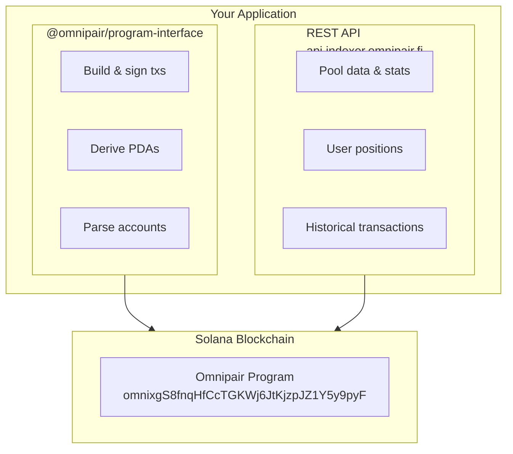

## Introduction

Omnipair provides a comprehensive developer toolkit for building DeFi applications on Solana. Whether you're integrating swaps, building lending interfaces, or creating automated strategies, our stack gives you everything you need.

<CardGroup cols={3}>
  <Card title="Solana Program" icon="rust" href="/developers/program">
    On-chain Rust program with all protocol instructions
  </Card>
  <Card title="TypeScript SDK" icon="npm" href="/developers/sdk">
    Anchor-based SDK with full type safety
  </Card>
  <Card title="REST API" icon="server" href="/developers/api">
    Real-time indexer API for querying protocol data
  </Card>
</CardGroup>

## Architecture

<Frame>

</Frame>

## Program ID

The Omnipair program is deployed on Solana mainnet and devnet:

| Network | Program ID |
| ------- | -------------------------------------------- |
| Mainnet | `omnixgS8fnqHfCcTGKWj6JtKjzpJZ1Y5y9pyFkQDkYE` |
| Devnet  | `omnixgS8fnqHfCcTGKWj6JtKjzpJZ1Y5y9pyFkQDkYE` |

## Quick Start

### 1. Install the SDK

```bash
npm install @omnipair/program-interface @coral-xyz/anchor @solana/web3.js
```

### 2. Initialize the Program

```typescript
import { Program, AnchorProvider } from "@coral-xyz/anchor";
import { Connection, PublicKey } from "@solana/web3.js";
import { IDL } from "@omnipair/program-interface";
import type { Omnipair } from "@omnipair/program-interface";

// Create connection and provider
const connection = new Connection("https://api.mainnet-beta.solana.com");
const provider = new AnchorProvider(connection, wallet, {});

// Initialize typed program instance
const program = new Program<Omnipair>(IDL, provider);
```

### 3. Fetch Pool Data

```typescript
import { derivePairAddress } from "@omnipair/program-interface";
import { createHash } from "node:crypto";

// Derive pair PDA
const token0 = new PublicKey("So11111111111111111111111111111111111111112"); // SOL
const token1 = new PublicKey("EPjFWdd5AufqSSqeM2qN1xzybapC8G4wEGGkZwyTDt1v"); // USDC

function computeParamsHash() {
  // Use the same initialization params as the on-chain initialize instruction.
  // See /developers/sdk for a full implementation.
  const payload = Buffer.concat([
    Buffer.from([1]), // version
    Buffer.from([30, 0]), // swapFeeBps (u16 LE)
    Buffer.from([128, 238, 54, 0, 0, 0, 0, 0]), // halfLife = 3_600_000 (u64 LE)
    Buffer.alloc(2), // fixedCfBps = None -> 0
    Buffer.alloc(8), // targetUtilStartBps
    Buffer.alloc(8), // targetUtilEndBps
    Buffer.alloc(8), // rateHalfLifeMs
    Buffer.alloc(8), // minRateBps
    Buffer.alloc(8), // maxRateBps
  ]);
  return createHash("sha256").update(payload).digest();
}

const paramsHash = computeParamsHash();
const [pairAddress] = derivePairAddress(token0, token1, paramsHash);

// Fetch pair account
const pair = await program.account.pair.fetch(pairAddress);

console.log("Reserve0:", pair.reserve0.toString());
console.log("Reserve1:", pair.reserve1.toString());
console.log("Total Debt0:", pair.totalDebt0.toString());
```

### 4. Execute a Swap

```typescript
// Build swap instruction
const swapIx = await program.methods
  .swap({
    amountIn: new BN(1_000_000), // 1 USDC
    minAmountOut: new BN(0),     // Set appropriate slippage
    isToken0In: false,           // Swapping token1 (USDC) for token0 (SOL)
  })
  .accounts({
    pair: pairAddress,
    // ... other accounts
  })
  .instruction();

// Sign and send transaction
const tx = new Transaction().add(swapIx);
const signature = await sendAndConfirmTransaction(connection, tx, [wallet]);
```

## Protocol Constants

Key protocol parameters that are useful for calculations:

| Constant | Value | Description |
| -------- | ----- | ----------- |
| `MAX_COLLATERAL_FACTOR_BPS` | 8,500 | Maximum 85% LTV for dynamic CF |
| `LTV_BUFFER_BPS` | 500 | 5% buffer between borrow and liquidation |
| `LIQUIDATION_PENALTY_BPS` | 300 | 3% total penalty on liquidation |
| `LIQUIDATION_INCENTIVE_BPS` | 50 | 0.5% reward for liquidators |
| `FLASHLOAN_FEE_BPS` | 5 | 0.05% flash loan fee |
| `LIQUIDITY_WITHDRAWAL_FEE_BPS` | 100 | 1% LP withdrawal fee |
| `NAD` | 1,000,000,000 | 10^9 precision for fixed-point math |
| `BPS_DENOMINATOR` | 10,000 | Basis points denominator |

## Resources

<CardGroup cols={2}>
  <Card title="GitHub Repository" icon="github" href="https://github.com/omnipair/omnipair-rs">
    Source code, examples, and verifiable builds
  </Card>
  <Card title="NPM Package" icon="npm" href="https://www.npmjs.com/package/@omnipair/program-interface">
    TypeScript SDK on NPM
  </Card>
  <Card title="Indexer Repository" icon="database" href="https://github.com/omnipair/omnipair-indexer">
    Data indexer and REST API source
  </Card>
  <Card title="Security" icon="shield" href="/documentation/resources/security">
    Audit reports and security information
  </Card>
</CardGroup>

## Support

- **Discord**: [discord.gg/omnipair](https://discord.gg/omnipair) - Developer support channel
- **GitHub Issues**: [omnipair/omnipair-rs/issues](https://github.com/omnipair/omnipair-rs/issues) - Bug reports and feature requests
